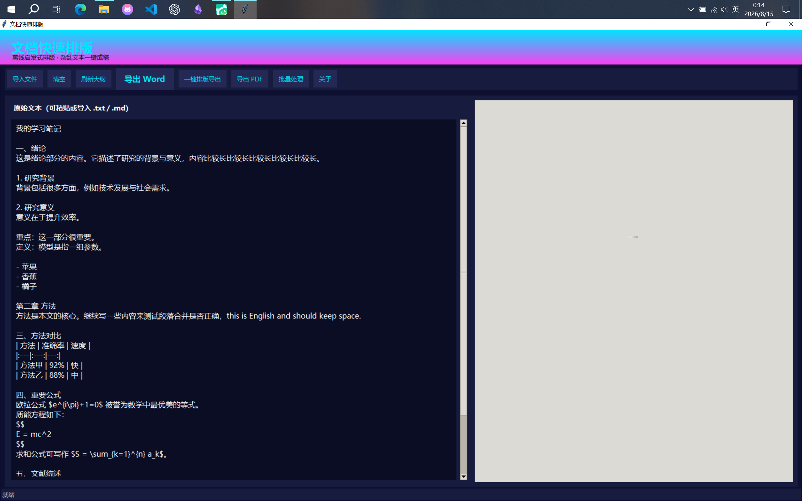

# DocFormatter

> 离线 Windows 桌面工具：导入 TXT / Markdown，一键智能整理为符合学术 / 办公规范的 Word 文档。

[](LICENSE)
[](https://www.python.org)
[](#-快速开始)
[](https://github.com/skycommon/DocFormatter/releases)



[功能特性](#-功能特性) ·
[快速开始](#-快速开始) ·
[使用说明](#-使用说明) ·
[开发](#-开发) ·
[打包](#-打包) ·
[FAQ](#-faq) ·
[路线图](#-路线图) ·
[贡献](#-贡献) ·
[许可证](#-许可证)

---

## 📖 项目简介

DocFormatter 是一款**完全离线**的 Windows 桌面排版工具，专为需要将纯文本资料快速转换为规范 Word 文档的用户设计——论文、课程报告、读书笔记、办公文档皆可。

无需联网、无需注册、无需安装 Python。导入 `.txt` / `.md` 文件，选择排版预设（毕业论文 / 通用论文 / 课程论文 / 默认 / 简洁风 / 阅读风），即可一键生成符合 GB/T 7714 参考文献规范的 `.docx`。

### 为什么做这个？

- 写论文时反复调整格式太枯燥，把规则交给工具
- 离线运行：资料不外传，适合论文 / 内部文档 / 涉密材料
- 支持中英混排字体（西文 Times New Roman + 中文 宋体 / 等线 / 楷体 等自动分离）

---

## ✨ 功能特性

### 核心
- ✅ **一键整理**：拖入 `.txt` / `.md` → 自动应用排版规则 → 导出 `.docx`
- ✅ **6 套预设**：默认 / 毕业论文 / 通用论文 / 课程论文 / 简洁风 / 阅读风
- ✅ **中英混排字体分离**：西文 Times New Roman + 中文 宋体 / 等线 / 楷体 / 微软雅黑 等
- ✅ **实时预览**：右侧所见即所得，调整即生效
- ✅ **批量处理**：一次导入多文件，统一应用预设

### 学术 / 论文专用
- ✅ 数学公式开关（Word 原生 OMML 格式）
- ✅ 引用 / 脚注（上标编号 + 自动编号）
- ✅ 页眉 / 页脚 / 页码
- ✅ 参考文献样式：GB/T 7714 顺序编码制 + 纯数字序号
- ✅ 标题层级（一级 / 二级 / 三级 / 正文）

### 工程
- ✅ **完全离线**：模型 / 资源全部内置，无需联网
- ✅ **单文件 exe**：~18 MB，启动 < 2 秒，常驻 < 80 MB
- ✅ **多尺寸应用图标**：16/24/32/48/64/128/256 全分辨率，桌面 / 任务栏清晰可见
- ✅ **桌面快捷方式生成**：手写 MS-SHELLINK 二进制，绕过沙箱 COM 限制
- ✅ **导出 PDF**：借助本机 Word / WPS
- ✅ **主题**：内置浅色主题（与 IDE 标题栏一致），文字全黑、背景全白
- ✅ **中英双语 UI**：运行时实时切换
- ✅ **配置导入 / 导出**：JSON 跨电脑迁移
- ✅ **常用导出位置**：可勾选的快速目录

---

## 🚀 快速开始

### 普通用户（下载即用）

1. 前往 [Releases · v1.0.2](https://github.com/skycommon/DocFormatter/releases/tag/v1.0.2)  下载 `DocFormatter.exe`
2. 双击运行（首次启动约 1 秒）
3. 主界面 → 拖入 `.txt` / `.md` 文件 → 选择预设 → 点击「一键整理」 → 选择导出位置

> 单文件 exe 无需安装，复制到任意目录都能跑。Win10 / Win11 全兼容。

### 命令行

```cmd
:: 启动 GUI
DocFormatter.exe

:: 查看版本
DocFormatter.exe --version
```

---

## 📘 使用说明

### 排版预设对照

| 预设 | 正文字体（中文 / 西文） | 标题字体（中文 / 西文） | 适用场景 |
|------|----------------------|----------------------|---------|
| **默认** | 宋体 / Times New Roman | 黑体 / Times New Roman | 一般办公 |
| **毕业论文** | 宋体 / Times New Roman | 黑体 / Times New Roman | 学位论文 |
| **通用论文** | 宋体 / Times New Roman | 黑体 / Times New Roman | 期刊投稿 |
| **课程论文** | 宋体 / Times New Roman | 黑体 / Times New Roman | 课程作业 |
| **简洁风** | 微软雅黑 / Times New Roman | 微软雅黑 / Times New Roman | 简洁办公 |
| **阅读风** | 楷体 / Times New Roman | 楷体 / Times New Roman | 长文阅读 |

> 每套预设都包含完整规格：正文字体 / 标题字体 / 行距 / 段后距 / 页边距 / 标题居中 / 拉丁字体等。详见 [源码 `formatter.py`](formatter.py)。

### 配置文件

程序会在 exe 同目录（onefile 模式下即 `sys.executable` 所在目录）自动生成并持久化以下文件，关闭即保留、跨电脑可迁移：

- `settings.json`：仅保存西文字体偏好（如 `{"western_font": "Times New Roman"}`）。
- `export_locations.json`：常用导出位置列表（路径 + 是否勾选）。

如果想把**全部排版设置**（预设、字体、页脚、参考文献样式等）一次性迁移到另一台电脑，请使用主界面 → 排版选项里的「导出配置」生成 JSON，在新机器「导入配置」即可。该文件结构示例：

```json
{
  "app": "DocFormatter",
  "version": "1.0.2",
  "config": {
    "preset": "默认",
    "language": "zh",
    "auto_toc": false,
    "math_pretty": true,
    "cite_sup": true,
    "ref_auto": true,
    "ref_style": "gb7714",
    "body_font": "宋体",
    "head_font": "黑体",
    "title_font": "黑体",
    "body_size": 11,
    "western_font": "Times New Roman",
    "export_locations": []
  }
}
```

---

## 🛠 开发

### 环境要求

- Python 3.14.6+（推荐 3.14.x）
- Windows 10 / 11
- ~250 MB 磁盘（含 venv + PyInstaller 构建产物）

### 本地运行

```bash
git clone https://github.com/skycommon/DocFormatter.git
cd DocFormatter

# 准备 venv
python -m venv venv314
.\venv314\Scripts\python.exe -m pip install -r requirements.txt

# 启动 GUI
.\venv314\Scripts\python.exe gui.py
```

### 项目结构

```
DocFormatter/
├── .github/
│   └── workflows/
│       └── build-windows.yml    # Windows CI（构建 exe + 上传 artifact）
├── docs/
│   └── screenshot-main.png      # README 主截图
├── gui.py                       # 主 GUI（tkinter，~66 KB）
├── formatter.py                 # Word 排版核心（python-docx，~45 KB）
├── pdf_export.py                # PDF 导出辅助
├── i18n.py                      # 中英文案
├── DocFormatter.spec            # PyInstaller 打包配置
├── build.bat                    # 一键打包脚本（Windows）
├── app_icon_simple.ico          # 应用图标（多尺寸）
├── icon_preview.png             # 图标预览
├── make_icon_simple.py          # 图标生成器
├── make_desktop_shortcut.py     # 桌面快捷方式生成器
├── mk_desktop_shortcuts.py      # 桌面快捷方式批量生成器
├── mk_two_lnk.py                # 旧版快捷方式工具
├── pdf_freeze_test.spec         # PyInstaller PDF 导出测试 spec
├── ref_demo_gb.docx             # GB/T 7714 参考文献样例
├── ref_demo_num.docx            # 数字序号参考文献样例
├── .gitignore
├── .gitattributes
├── requirements.txt             # 运行时依赖
├── requirements-dev.txt         # 开发依赖（含 pyinstaller）
├── LICENSE                      # MIT
├── CHANGELOG.md                 # 版本变更
└── README.md
```

---

## 📦 打包

```cmd
:: 激活 venv（py 3.14.x）
.\venv314\Scripts\activate

:: 重新生成单文件 exe
.\venv314\Scripts\pyinstaller.exe --noconfirm DocFormatter.spec

:: 输出：dist\DocFormatter.exe（约 18 MB）
```

或者直接双击运行 `build.bat`。

### ⚠️ 沙箱 / CI 注意事项

| 坑 | 表现 | 规避 |
|----|------|------|
| `--distpath /c/Users/...` | Git Bash 下 `/c/...` 被误判为相对路径，落到 `D:\c\Users\...` 错路径 | 用项目内绝对路径如 `D:/.../dist` |
| `--clean` | 触发沙箱 `sitecustomize._safe_remove` 抛 `OSError`，构建中止 | **不要用 `--clean`**；用全新 `--workpath/--distpath` |
| ICO 多尺寸 | `append_images=[...]` 只写出第一张（16×16），桌面 / 任务栏空白 | 用「单张大图 + `save(..., sizes=[(16,16)...(256,256)])`」 |
| onefile 持久化 | `__file__` 指向临时解压目录，用户配置关闭即丢 | 改用 `os.path.dirname(sys.executable)`（当 `sys.frozen`） |
| `taskkill /F` | Git Bash 下 `//F` 误判 | 用 `cmd //c "taskkill /F /IM xxx"` |

---

## ❓ FAQ

**Q: 启动报 "ModuleNotFoundError: No module named 'tkinter'"？**
A: 重新安装带 tk 的 Python 发行版（如 [python.org 官方](https://www.python.org/downloads/windows/) 3.14.x），不要装 Microsoft Store 版。

**Q: 任务栏图标是空白？**
A: `app_icon_simple.ico` 必须是多分辨率（16/24/32/48/64/128/256）。重新 `python make_icon_simple.py` 生成即可。

**Q: 导出 PDF 失败？**
A: 当前依赖本机已安装的 Word / WPS 调 COM 接口。纯脱机导出 PDF 计划见 [路线图](#-路线图)。

**Q: 配置如何跨电脑迁移？**
A: 主界面 → 设置 → 「导出配置」生成 JSON；在新机器「导入配置」即可。

**Q: macOS / Linux 能用吗？**
A: 不能。本项目仅承诺 Windows 支持（沙箱 .lnk / COM / 注册表 等依赖 Windows API）。

**Q: 我的资料会上传吗？**
A: 不会。完全离线，所有处理在本地完成。

---

## 🗺 路线图

- [ ] **LibreOffice headless 导出 PDF**（脱离 Word / WPS 依赖）
- [ ] 自定义排版规则可视化编辑器
- [ ] Pandoc / LaTeX 输入支持
- [ ] 自定义主题 / 配色方案
- [ ] 多窗口 / 多标签页
- [ ] 撤销 / 重做

---

## 🤝 贡献

欢迎 PR！请遵循：

- Python 3.14+ 兼容
- Windows-first（macOS / Linux 不在支持范围）
- 中文为主，UI 文案走 `i18n.py`
- 提交前跑一次 `build.bat` 确认能构建

---

## 📜 许可证

[MIT](LICENSE) © 2026 skycommon

---

## 🙏 致谢

- [python-docx](https://github.com/python-openxml/python-docx) — Word 文档生成
- [Pillow](https://python-pillow.org/) — 图像与图标
- [PyInstaller](https://www.pyinstaller.org/) — 单文件打包
- [tkinter](https://docs.python.org/3/library/tkinter.html) — 跨平台 GUI

---

## 📮 联系方式

- GitHub Issues: <https://github.com/skycommon/DocFormatter/issues>
- Email: 2823729808@qq.com